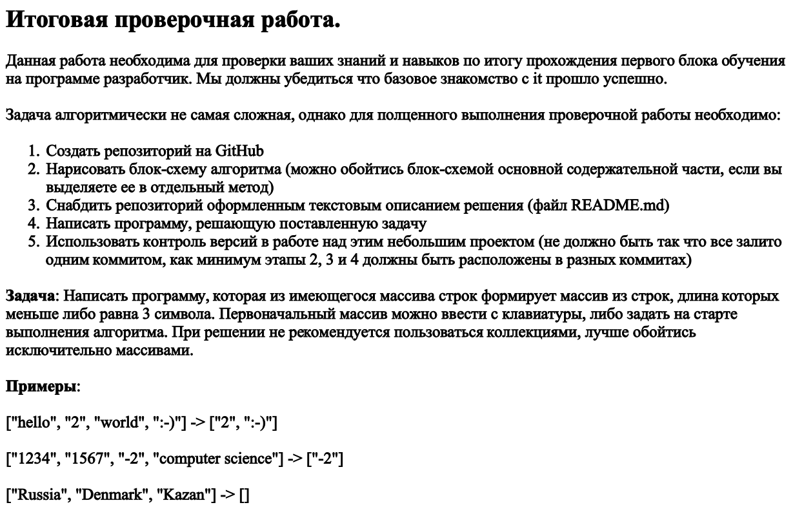

# Приветствую, дорогой пользователь!

*Ниже можешь ознакомиться с заданием:*

# Инструкция:

1) В папке _Decision_ находится программа-решение поставленной задачи:
    - Введите с клавиатуры массив строк через пробел;
    - Дождитесь выполнения программы;
    - Программа выдает результат - это массив строк, длинна которых меньше либо равна 3 символа;

2) В папке _Scheme_ находится блок-схема алгоритма.

# Спасибо за внимание!
 Хорошего дня! :)

